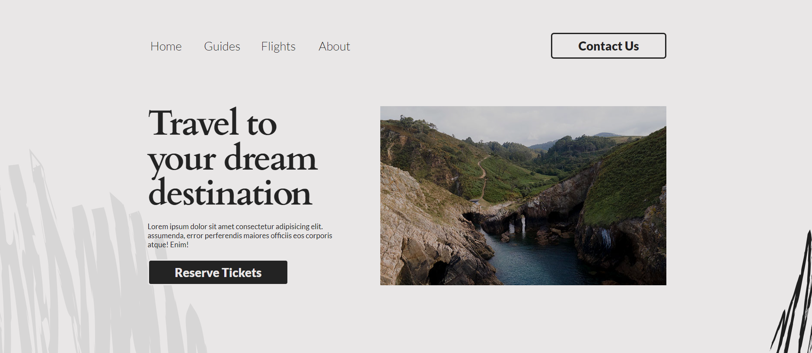

# "Travel Blog" markup training :muscle:

Humble example of landing page markup    
The very first markup of mine, not so high perfomanced but finished one
    
----
## Pros :heavy_check_mark:
* use attached fonts
* work out using positioning and layers
* meet :not() and : last-child of CSS
* use flexbox and grid
* use CSS variables
* use only 010 CSS specification (classes only)
* meet HTML form-tag

----
## Things to improve :exclamation:
* a lot of repetitions of CSS code
* mostly pixel-perfect (not adaptive markup)
* not using BEM methodology of CSS
* not using any of CSS preprocessors
* not using semantic tags of HTML at all
* bad CSS classes naming
* not working in every browser (trained in Chrome only)

----
## Contacts
* [Vkontakte](https://vk.com/ivanpostarnak)
* ivan.postarnak.s@gmail.com